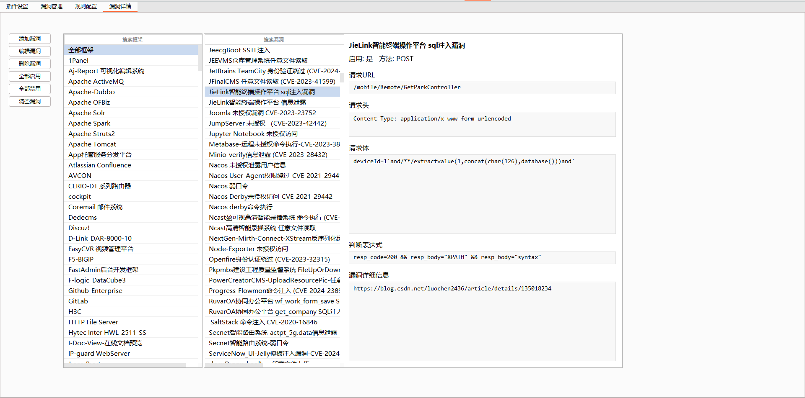
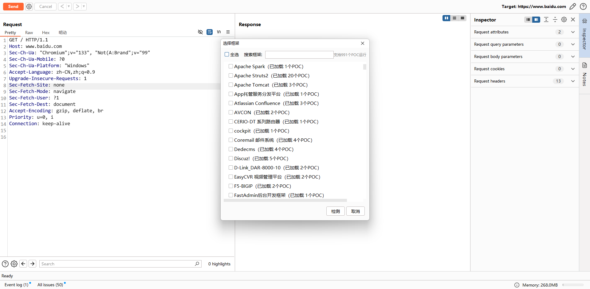
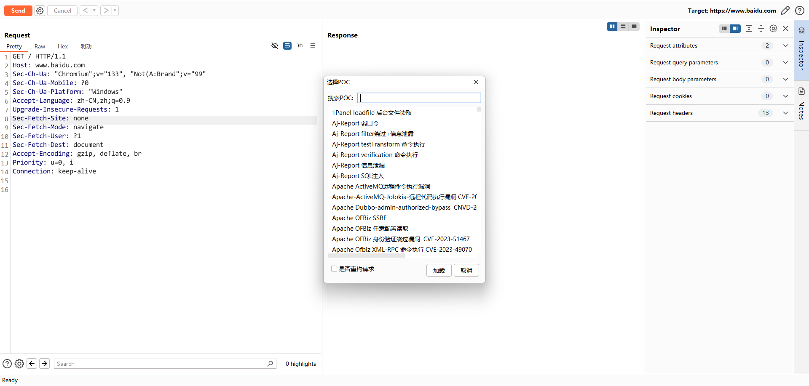

## 📖 简介

**Rinte** 是一款专为渗透测试人员设计的 BurpSuite 插件，提供自动化CMS漏洞扫描功能。该插件集成了框架检测、漏洞扫描和加载指定POC等多种功能，帮助渗透测试人员快速识别目标系统的安全漏洞。支持1000+框架POC、支持动态加载POC、指定框架扫描等。

## 🚀 使用

将`Rinte_config.json`放到jar包目录下，配置 `Rinte_config.json` 文件或者插件设置模块

查看检测规则

查看漏洞详情

指定框架扫描

动态加载单个POC

